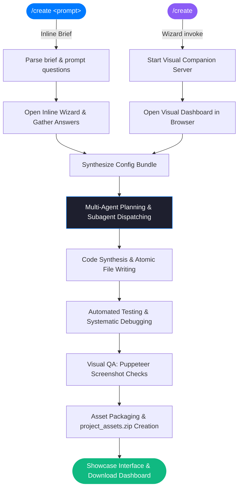

<div align="center">


# create
### **The Intelligent Design & Development Tool for Claude**

*Synthesize production-ready digital products and environments directly from a prompt. Zero templates. Zero compromise.*

<br/>

[](https://github.com/freyathenaa/create-skill)&nbsp;
[](https://github.com/freyathenaa)&nbsp;
[](#design-aesthetics)&nbsp;
[](#synthesis-stack)

<br/>

---

</div>

## What is create?

`create` is an autonomous engineering pipeline that translates a single prompt or visual briefing into high-fidelity, interactive digital products. Whether generating a minimalist SaaS dashboard, a retro blog, a holographic AI interface, or a developer IDE workspace, the agent handles the planning, coding, unit testing, visual QA, and deliverable bundling.

It operates in two entry modes:

*   **Inline Brief Mode**: Intercepts prompts (e.g. `/create a token management console...`), runs an interactive browser-based clarifying wizard, and synthesizes the workspace directly.
*   **Visual Curation Wizard**: Initiated with `/create`. Boots the Visual Companion Server and guides the creator through visual styling, technology stack, and backend provisioning options.

---

## Design Aesthetics

All synthesized projects adhere to refined, modern, and industry-standard design specifications. There are no generic, unstyled browser defaults or retro themes.

| Theme | Visual Language | Typography & Details |
| :--- | :--- | :--- |
| **🍏 Apple HIG** | Clean whites or OLED blacks, backdrop blur layers, generous whitespace. | SF Pro Display, soft translucent overlays, large rounded cards (16px–24px). |
| **▲ Geist Minimal** | High-contrast monochrome (pure black/white), strict structural layouts. | Inter/Geist Mono, ultra-thin borders (1px), sharp elements (6px–8px radii). |
| **🌌 Linear Dark** | Deep technical dark mode (`#0E0F11`), subtle gradient highlights, high precision. | Custom iconography, dark translucent panels, micro-shadows, violet accents. |
| **💳 Stripe SaaS** | Sophisticated ivory or deep navy panels, large diffused drop shadows, high trust. | Refined editorial serif headings paired with clean sans-serif body text. |

---

## Architecture & Workflow

`create` behaves like a complete engineering team using a strict state machine:



---

## Product Blueprints

The synthesizer supports the execution of several production-ready product classes:

*   **`saas` / Web App**: Full-stack application frameworks, authentication wrappers, API routing setups, and Stripe billing integrations.
*   **`dashboard`**: Responsive metrics grids, data graphing telemetry, and telemetry dashboards.
*   **`ide` / Developer Workspace**: Interactive multi-agent IDE dashboards featuring Kanban task boards and simulated typing/editing panels.
*   **`jarvis`**: Voice-activated Agentic Workspace panels with camera gesture tracking, audio synths, and command terminals.
*   **`data-app`**: Telemetry dashboards and data visualizations powered by BigQuery or external endpoints.
*   **`chrome-extension`**: Manifest V3 Chrome extensions pre-packaged for Web Store distribution.
*   **`blog` / Indie Webspace**: Dual-column minimalist sites with custom guestbooks, shoutboxes, and reading layout presets.
*   **`course` & `ebook`**: Multi-module curriculum templates, worksheets, chapters, and audience lead magnets.

---

## Synthesis Stack

| Layer | Technologies | Role |
| :--- | :--- | :--- |
| **Orchestration** | Claude Agent SDK | Execution flow, planning, and task coordination |
| **Frameworks** | React (Vite) / Next.js / Vanilla HTML | Scaffolds application layers based on configuration |
| **Database/Auth** | Firebase (Firestore + Auth) | Provisioned backend and security rules |
| **Automation** | Express.js + Python | Interactive server hosting and event synchronization |
| **Visual Validation** | Puppeteer | Headless capture and automatic path verification |

---

## Getting Started

1. **Installation**:
   ```bash
   git clone git@github.com:freyathenaa/create-skill.git
   cd create-skill
   npm install
   ```

2. **Integration**:
   Move the folder into your Claude skills path (`~/.claude/skills/create/`). The slash command `/create` will instantly register.

---

<div align="center">

*Built for creators who ship.*

[](https://github.com/freyathenaa)

</div>
