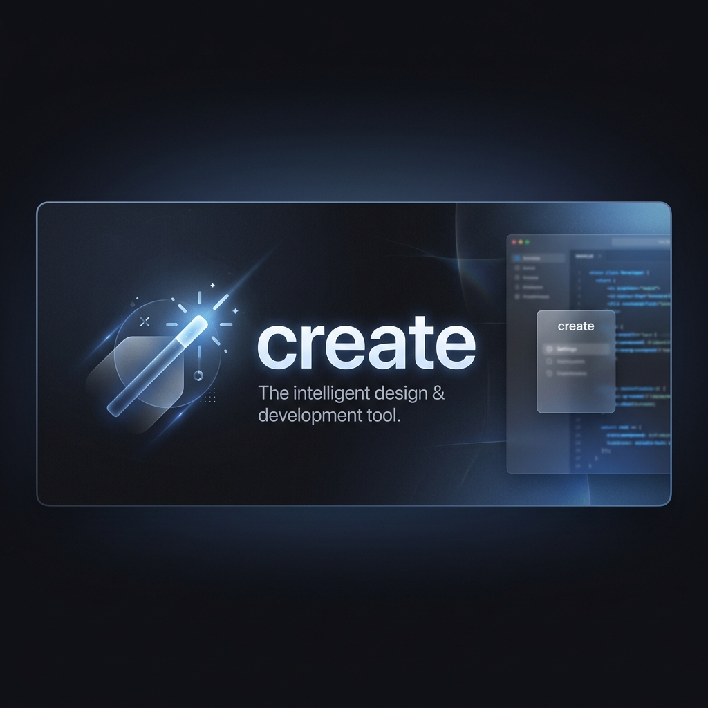
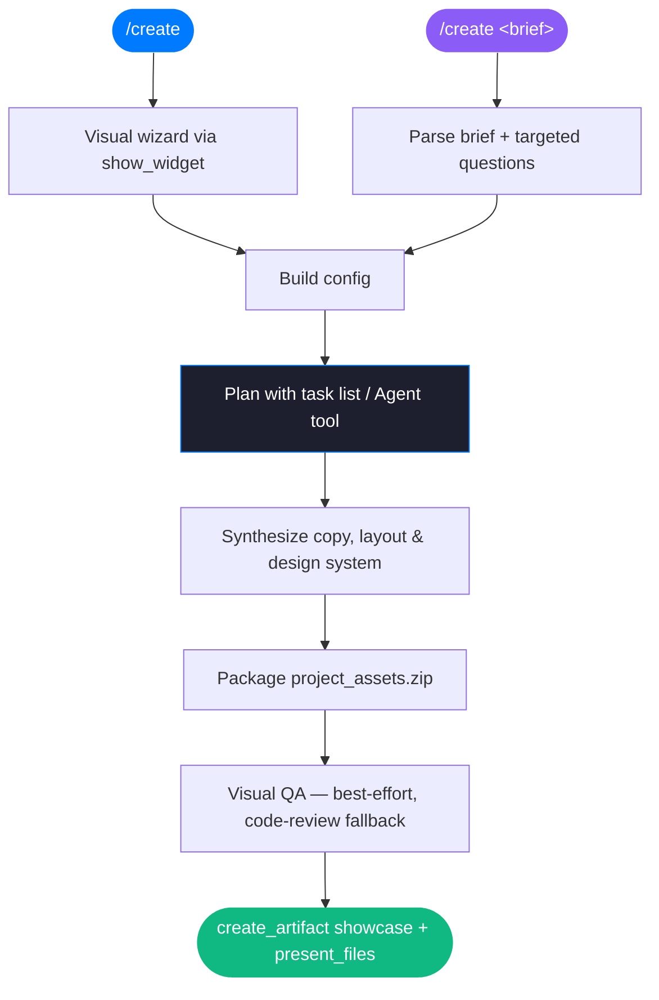

<div align="center">



# create

### **Turn one prompt into a finished, ready-to-ship digital product.**

*A skill that synthesizes premium landing pages, blogs, dashboards, HUDs, and more — from a short brief, with real design systems. Two editions: one for Google Antigravity, one for Claude Desktop.*

<br/>

[](#)&nbsp;
[](./README.antigravity.md)&nbsp;
[](./claude/README.md)&nbsp;
[](#design-aesthetics)

<br/>

---

</div>

## What is `create`?

`create` is an autonomous design-and-build pipeline. Give it a one-line brief — or just run `/create` and answer a short wizard — and it synthesizes a high-fidelity, interactive digital product: copy, layout, design system, and packaged source files, ready to sell or ship.

It is **not** a template gallery. Every output is generated fresh against a chosen aesthetic (Apple HIG, Vercel Geist, Linear Dark, or Stripe SaaS) and a chosen positioning angle, then QA'd and delivered.

This repository ships **two editions of the same skill**, tuned to two different runtimes.

## Two editions

| | 🟣 **Antigravity edition** | 🟠 **Claude Desktop edition** |
| :--- | :--- | :--- |
| **Lives in** | repo root — [`SKILL.md`](./SKILL.md), [`README.antigravity.md`](./README.antigravity.md) | [`claude/`](./claude/) — [`claude/SKILL.md`](./claude/SKILL.md), [`claude/README.md`](./claude/README.md) |
| **Runtime** | Google Antigravity (agent shell **is** the user's machine) | Claude Desktop / Cowork (agent shell is a **sandbox**) |
| **Input UI** | Browser wizard served by a local Node "Visual Companion Server" | Visual wizard via `show_widget`, falling back to `AskUserQuestion` |
| **Showcase** | `06_showcase.html` served on `localhost` | Persisted **Cowork artifact** (`create_artifact`) |
| **Downloads** | `/api/download` endpoint | `present_files` cards |
| **Planning** | Superpowers skills | Native task list + Agent/Task tool |
| **Visual QA** | Puppeteer vs `localhost` | Puppeteer vs `file://` — **best-effort**, auto code-review fallback |
| **Install to** | `~/.gemini/config/skills/create/` | `~/.claude/skills/create/` |

Why two? The Antigravity edition assumes the agent's shell is the user's own computer, so it can run a web server on `localhost` and open the user's browser. In Claude Desktop the shell is an isolated sandbox — a server there is unreachable and there's no display — so that edition swaps the whole mechanism for Cowork-native primitives (`AskUserQuestion`, `show_widget`, the task list, `create_artifact`, `present_files`). Full comparison and a one-command split recipe live in [`VARIANTS.md`](./VARIANTS.md).

## Quick start

**Claude Desktop**
```bash
cp -R claude ~/.claude/skills/create
cd ~/.claude/skills/create && npm install   # optional: Chromium for visual QA
```
Then run `/create` (or just ask Claude to "create" something). Pick options in the visual wizard and hit **Generate**.

**Antigravity**
```bash
cp -R . ~/.gemini/config/skills/create   # excludes nothing functional; see README.antigravity.md
```
Then run `/create`. See [`README.antigravity.md`](./README.antigravity.md) for the original docs.

## How it works (Claude Desktop edition)



The wizard's **Generate** button submits your choices straight back to Claude — no localhost, no polling. The result is delivered as an interactive showcase artifact plus downloadable source files.

## What it can make

`blog` · `saas` landing · `course` · `ebook` · `chrome-extension` · `data-app` · `dashboard` · `game` · `planner` · `wellness` · `jarvis` HUD · agent `ide`

<a id="design-aesthetics"></a>
## Design aesthetics

Refined, modern, industry-standard specs only — no unstyled defaults.

| Theme | Visual language |
| :--- | :--- |
| 🍏 **Apple HIG** | Clean whites / OLED black, glassmorphism, generous whitespace, SF Pro |
| ▲ **Vercel Geist** | High-contrast monochrome, thin borders, hyper-minimal grid, Inter/Geist |
| 🌌 **Linear Dark** | Deep `#0E0F11`, radial lighting, translucent cards, violet accents |
| 💳 **Stripe SaaS** | Ivory / navy, soft diffused shadows, editorial serif + clean sans |

## Repository structure

```
create-skill/
├── README.md                 # this landing page
├── README.antigravity.md     # the original Antigravity edition docs (preserved)
├── VARIANTS.md               # both editions compared + how to split them
├── SKILL.md                  # Antigravity edition skill
├── scripts/ · templates/     # Antigravity edition assets
├── assets/                   # banner
└── claude/                   # Claude Desktop edition (self-contained)
    ├── SKILL.md · README.md · package.json
    ├── scripts/capture-screen.js
    └── templates/            # wizard-widget, jarvis, ide, retro
```

## Pushing / GitHub auth

This is a normal git repo (`origin` points at SSH). To push your commits, set up SSH or the GitHub CLI on your own machine, then `git push -u origin main`. The short version: `brew install gh && gh auth login`, or generate an SSH key (`ssh-keygen -t ed25519`) and add it under GitHub → Settings → SSH keys.

---

<div align="center">

*Built for creators who ship.*

</div>
