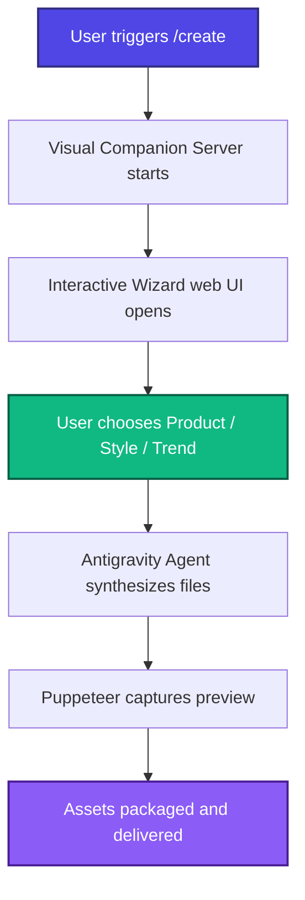

<div align="center">
  

  # ✨ Antigravity: Create Skill
  **Autonomous Visual Wizard & Digital Product Synthesizer**

  [](https://github.com/freyathenaa/create-skill/blob/main/LICENSE)
  [](https://nodejs.org)
  [](https://python.org)
  [](https://pptr.dev)

  ---
</div>

An advanced autonomous AI agent skill for launching interactive visual creation wizards, guiding design selections, and dynamically synthesizing premium digital products and landing pages using trend-informed design systems.

---

## 🎨 Visual Workflow



## 🚀 Key Features

*   **🎭 Interactive Visual Wizard**: Hosts a beautiful web interface to guide the user in selecting their digital product category, aesthetic style, and custom trend.
*   **📡 Visual Companion Server**: A localized server (`scripts/start-server.js`) that communicates selections directly to the agent.
*   **📸 Automatic Preview Capture**: Puppeteer-powered headless browser screen capture to ensure correct rendering and immediate visual feedback.
*   **🧬 Flexible Template Engine**: Standardized and easily customizable HTML/CSS templates for rapid visual generation.

---

## 📂 Project Architecture

```
create-skill/
├── 📁 scripts/
│   ├── 📄 start-server.js     # Express-based visual companion web server
│   ├── 📄 await-event.py      # Background event watcher and sync script
│   └── 📄 capture-screen.js   # Puppeteer screenshot automated capturing
├── 📁 templates/
│   ├── 📄 01_start.html       # Visual Wizard initial launch UI template
│   └── 📄 retro-components.css# Styled visual tokens for the wizard
├── 📄 SKILL.md                # System prompts & Agent behavior instructions
├── 📄 package.json            # Node project configuration
└── 📄 README.md               # Visual branding and usage documentation
```

### Technical Stack Details

| Component | Technology | Role / Purpose |
| :--- | :--- | :--- |
| **Server** | Node.js + Express | Host the interaction pages and receive event payloads |
| **Automation** | Puppeteer | Launch headless Chromium to capture high-fidelity screenshot assets |
| **Sync Engine** | Python 3 | Background listener to block/unblock the agent based on user inputs |
| **Styling** | Vanilla CSS | Premium visual layout using custom design tokens |

---

## 🛠 Setup & Installation

### 1. Prerequisites
- **Node.js** (v18.0.0 or higher)
- **Python** (v3.x or higher)

### 2. Install Dependencies
Clone the repository and install the required Node packages:
```bash
git clone git@github.com:freyathenaa/create-skill.git
cd create-skill
npm install
```

---

## 💻 Running the Wizard

To spin up the visual companion server:

```bash
node scripts/start-server.js
```

The server will initialize on port `3000` (or the configured environment port) and wait for the agent-assisted configuration events.

---

## ⚡ Integration with Antigravity

This skill is designed to run seamlessly with the **Antigravity AI Agent SDK**. When a user issues the `/create` slash command:
1. The agent starts the server.
2. The agent opens the browser/companion UI.
3. The user picks their custom styling configuration.
4. The agent reads the choices, builds the landing page using premium styling rules, and generates screenshots.
