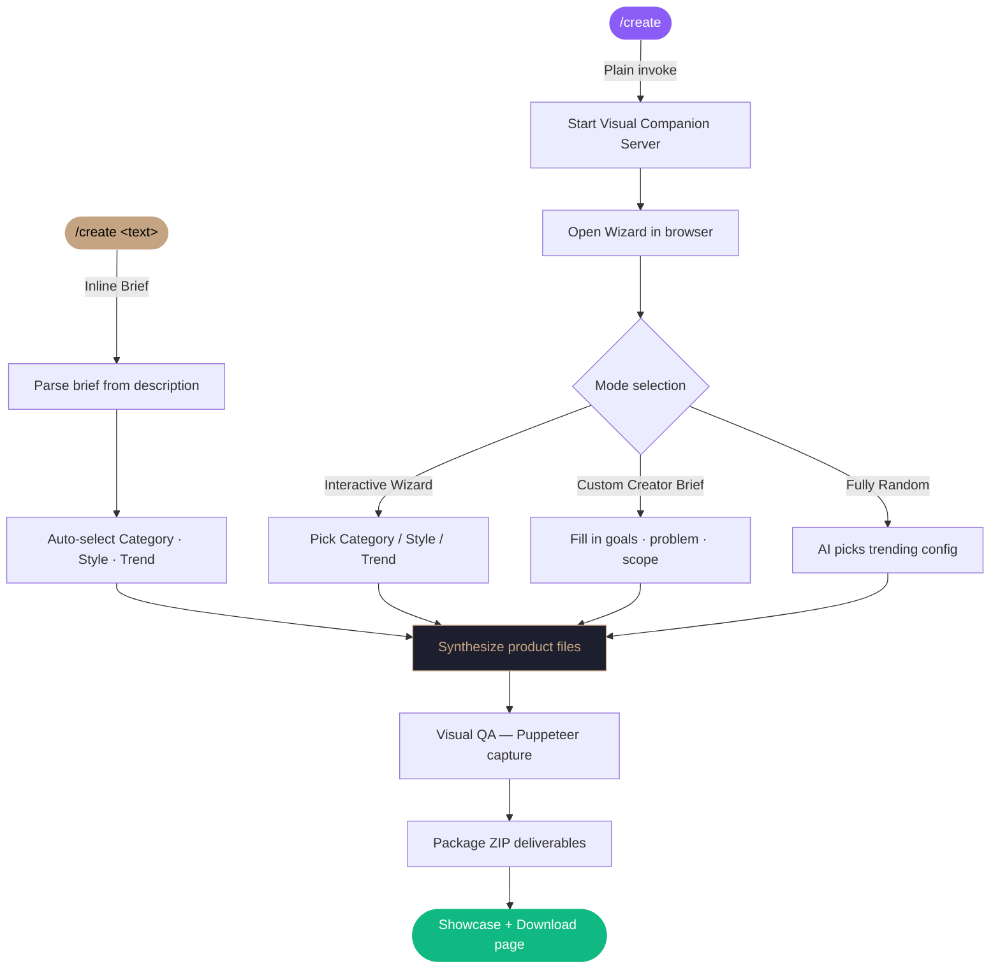

<div align="center">

<br/>

```
  ██████╗██████╗ ███████╗ █████╗ ████████╗███████╗
 ██╔════╝██╔══██╗██╔════╝██╔══██╗╚══██╔══╝██╔════╝
 ██║     ██████╔╝█████╗  ███████║   ██║   █████╗  
 ██║     ██╔══██╗██╔══╝  ██╔══██║   ██║   ██╔══╝  
 ╚██████╗██║  ██║███████╗██║  ██║   ██║   ███████╗
  ╚═════╝╚═╝  ╚═╝╚══════╝╚═╝  ╚═╝   ╚═╝   ╚══════╝
```

### **`/create`** — Autonomous Digital Product Synthesizer

*From command to product. No templates. No compromise.*

<br/>

[](https://github.com/freyathenaa/create-skill)&nbsp;
[](https://github.com/freyathenaa)&nbsp;
[](https://nodejs.org)&nbsp;
[](https://python.org)

<br/>

---

</div>

## What Is This?

`/create` is an Antigravity agent skill that turns a single command into a complete, premium digital product — landing pages, IDEs, SaaS interfaces, courses, dashboards, Jarvis AI panels, games, and more.

It operates in two modes:

| Mode | How to trigger | What happens |
|:---|:---|:---|
| **Inline Brief** | `/create an IDE that manages token usage...` | Skips the wizard entirely. Your description is parsed as a brief and synthesized immediately into a product. |
| **Visual Wizard** | `/create` | Launches an interactive visual companion in your browser. You select the product type, aesthetic, and market trend — the agent builds the rest. |

---

## Invocation Examples

```bash
# Inline mode — no wizard, direct generation
/create an IDE that assists in managing token usage. Users can manage a
system prompt, configure individual agent instructions, set the number of
agents, and log in to existing providers.

# Wizard mode — opens interactive browser UI
/create
```

When using inline mode, the agent automatically:
- Parses your description into a **creator brief** (brand name, goals, problem, scope)
- Selects the best matching **category**, **design style**, and **market trend**
- Generates files, zips deliverables, runs a visual QA check, and presents a showcase

---

## Workflow



---

## Product Categories

The agent can generate any of the following product types:

| Category | Description |
|:---|:---|
| `saas` | Landing page, API schema, database schema, payment flow |
| `blog` | Neocities-style personal webspace with retro UI |
| `course` | 5–8 module learning experience with worksheets |
| `ebook` | Chapter guides, conversion funnel, introductory hook |
| `dashboard` | Responsive telemetry grids and data visualization |
| `plugin` | Chrome Extension MV3, VS Code config, or Figma plugin |
| `game` | HTML Canvas arcade, WebGL shader, or text adventure |
| `planner` | Content calendars, marketing workflows, product pipelines |
| `wellness` | Nutrition schedulers, fitness splits, mindfulness loops |
| `jarvis` | Holographic browser-based AI control panel |
| `ide` | Interactive browser-based multi-agent developer workspace |

---

## Design Aesthetics

Each generated product is rendered in a curated visual style:

<table>
<tr>
<td><strong>y2k</strong> — Frutiger Metro · Web 2.0 Gloss</td>
<td><strong>retro-console</strong> — Japanese 3D · Gaming HUD</td>
</tr>
<tr>
<td><strong>claymorphic</strong> — Tactile Clay · Inflated Shapes</td>
<td><strong>crt-radio</strong> — VFD Screen · Post-Apocalyptic</td>
</tr>
<tr>
<td><strong>frutiger-aero</strong> — Glossy Aqua · Skeuomorphism</td>
<td><strong>vaporwave</strong> — 90s Glitch · Retrowave Lounge</td>
</tr>
<tr>
<td><strong>cyber-goth</strong> — Neon Obsidian · Circuit Grid</td>
<td><strong>gothic-grunge</strong> — Medieval Parchment · Ink Splatter</td>
</tr>
</table>

---

## Project Structure

```
create-skill/
├── scripts/
│   ├── start-server.js      ← Express visual companion web server
│   ├── await-event.py       ← Background event watcher (agent sync)
│   └── capture-screen.js    ← Puppeteer headless screenshot capture
├── templates/
│   ├── 01_start.html        ← Interactive wizard UI
│   ├── jarvis-template.html ← Holographic Jarvis panel template
│   ├── jarvis-template.css  ← Jarvis styling tokens
│   ├── ide-template.html    ← Agent IDE workspace template
│   └── ide-template.css     ← IDE styling tokens
├── SKILL.md                 ← Agent behavior instructions & workflow
├── package.json
└── README.md
```

---

## Stack

| Layer | Technology | Purpose |
|:---|:---|:---|
| **Server** | Node.js + Express | Hosts wizard pages, receives event payloads |
| **Event Sync** | Python 3 | Blocks/unblocks agent on user wizard input |
| **Visual QA** | Puppeteer (Chromium) | Headless screenshot capture for styling validation |
| **Styling** | Vanilla CSS | Premium design tokens, no framework dependencies |

---

## Installation

```bash
git clone git@github.com:freyathenaa/create-skill.git
cd create-skill
npm install
```

**Requirements:** Node.js ≥ 18, Python 3.x

---

## Integration with Antigravity

This skill runs as part of the [Antigravity AI](https://github.com/freyathenaa) agent system. Drop the `create/` folder into your Antigravity skills directory and the `/create` slash command becomes immediately available.

```
~/.gemini/config/skills/
└── create/          ← this repo
    ├── SKILL.md
    ├── scripts/
    └── templates/
```

The agent handles everything: server startup, wizard coordination, file generation, visual QA, and asset delivery.

---

<div align="center">

<br/>

*Built for creators who ship.*

[](https://github.com/freyathenaa)

<br/>

</div>
