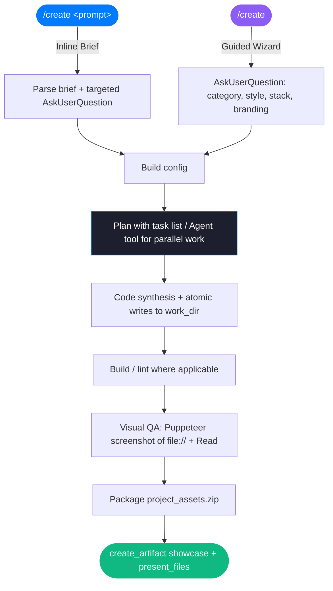

<div align="center">

# create — Claude Desktop edition

### **The Intelligent Design & Development Tool for Claude Desktop**

*Synthesize production-ready digital products and environments directly from a prompt. Zero templates. Zero compromise.*

<br/>

[](https://claude.ai)&nbsp;
[](#design-aesthetics)&nbsp;
[](#synthesis-stack)

<br/>

---

</div>

## What is this?

This is the **Claude Desktop / Cowork edition** of the `create` skill. It translates a single prompt or guided brief into high-fidelity, interactive digital products, then delivers them natively inside Claude Desktop. The Antigravity edition lives in the repository root; see [`../VARIANTS.md`](../VARIANTS.md) for how the two differ.

The core difference: in Claude Desktop the agent's shell is a sandboxed Linux workspace, so a `localhost` server there can't reach your browser. This edition therefore drops the Antigravity browser-wizard / local-server / event-loop mechanism and uses Cowork-native primitives instead.

It operates in three entry modes:

*   **Inline Brief** — `/create a token management console...`: asks only the few clarifying questions it needs via `AskUserQuestion`, then builds.
*   **Guided Wizard** — a plain `/create`: renders an interactive visual form (via `show_widget`) whose **Generate** button submits your picks back to Claude; falls back to `AskUserQuestion` if the visual tools aren't available.
*   **Surprise Me** — a wizard option that randomizes every choice and builds immediately.

Results are delivered as an interactive **showcase artifact** plus the source files and a `project_assets.zip`, presented as downloadable cards.

---

## Design Aesthetics

Refined, modern, industry-standard specs only — no unstyled defaults or retro themes.

| Theme | Visual Language | Typography & Details |
| :--- | :--- | :--- |
| **🍏 Apple HIG** | Clean whites or OLED blacks, backdrop blur, generous whitespace. | SF Pro Display, translucent overlays, 16–24px radii. |
| **▲ Geist Minimal** | High-contrast monochrome, strict structural grid. | Inter/Geist, 1px borders, 6–8px radii. |
| **🌌 Linear Dark** | Deep `#0E0F11`, subtle gradient lighting, high precision. | Translucent panels, micro-shadows, violet accents. |
| **💳 Stripe SaaS** | Ivory / white / deep navy, soft diffused shadows. | Editorial serif headings + commercial sans body. |

---

## Architecture & Workflow



---

## Synthesis Stack

| Layer | Technologies | Role |
| :--- | :--- | :--- |
| **Orchestration** | Claude Agent SDK | Execution flow, planning, and task coordination |
| **Frameworks** | React (Vite) / Next.js / Vanilla HTML | Scaffolds application layers based on configuration |
| **Database/Auth** | Firebase (Firestore + Auth) | Provisioned backend and security rules |
| **Interaction** | AskUserQuestion + task list | Native brief gathering and live build progress |
| **Visual Validation** | Puppeteer (headless, `file://`) | Screenshot capture + `Read` verification, no server |
| **Delivery** | `create_artifact` + `present_files` | Interactive showcase and downloadable source bundle |

---

## What ships in this folder

```
claude/
├── SKILL.md                  # the Claude Desktop skill instructions
├── README.md                 # this file
├── package.json              # puppeteer dependency for optional visual QA
├── scripts/
│   └── capture-screen.js     # optional headless screenshot for QA (works against file:// URLs)
└── templates/
    ├── wizard-widget.html     # the visual wizard form (rendered via show_widget)
    ├── jarvis-template.html / .css
    ├── ide-template.html / .css
    └── retro-components.css
```

The legacy `start-server.js` and `await-event.py` (browser-wizard / event loop) are **not** included here — the `show_widget` wizard, `AskUserQuestion`, and Cowork artifacts replace them. They remain in the Antigravity edition at the repo root. The Puppeteer screenshot is now best-effort: if a launchable Chromium isn't available (common in sandboxes), the skill auto-falls back to a code/well-formedness review and still delivers.

---

## Getting Started

1. **Install QA dependency** (optional but recommended):
   ```bash
   cd claude
   npm install   # fetches Puppeteer/Chromium for the visual-QA step
   ```

2. **Install the skill**:
   Copy this `claude/` folder into your Claude skills path as `~/.claude/skills/create/`. Then ask Claude to "create" something, or run `/create`.

---

<div align="center">

*Built for creators who ship.*

</div>
